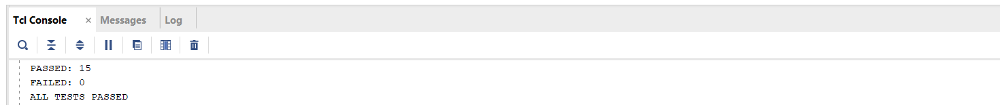
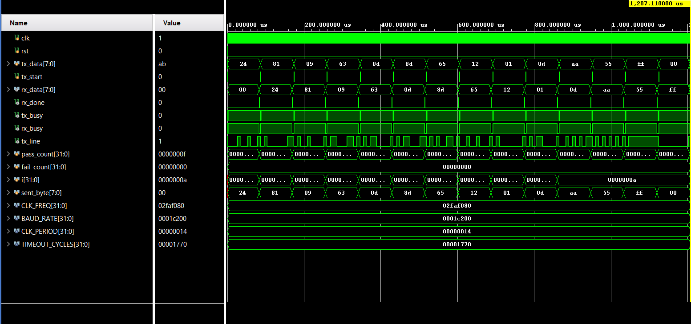
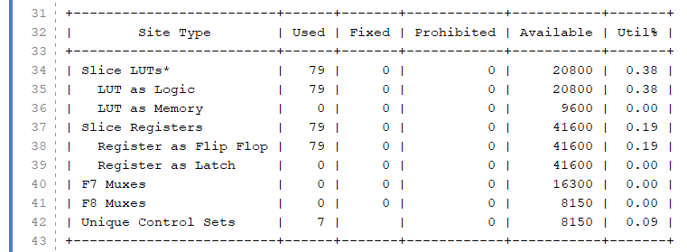

# UART (Universal Asynchronous Receiver/Transmitter) — Verilog

A complete UART transmitter and receiver pair designed in Verilog, following the 8-N-1 format (8 data bits, no parity, 1 stop bit). Verified with a self-checking testbench including randomized data, known edge-case byte patterns, and a mid-transmission reset recovery test. Synthesized and simulated in Xilinx Vivado.

## Architecture

Modular design split into 4 files:

- **`baud_gen.v`** — Parameterized baud rate generator producing a 16x oversampling tick, shared between TX and RX. Configurable via `CLK_FREQ` and `BAUD_RATE` parameters (default: 50MHz clock, 115200 baud).
- **`uart_tx.v`** — Transmitter FSM (IDLE → START → DATA → STOP). Transmits LSB-first, one bit per 16 baud ticks.
- **`uart_rx.v`** — Receiver FSM with **noise-rejecting start-bit confirmation**: samples mid-start-bit (tick 7) to confirm a valid start rather than a glitch, then samples each data bit at its center (tick 15) for reliable capture away from signal transitions.
- **`uart_top.v`** — Top-level integration, wiring `baud_gen` + `uart_tx` + `uart_rx` together with an internal TX→RX loopback for self-contained testing.

## Verification
Self-checking testbench (`uart_top_tb.v`) covering:
- 10 randomized data bytes
- 4 known edge-case byte patterns (`0xAA`, `0x55`, `0xFF`, `0x00`) — chosen to catch stuck-bit and alternating-bit errors
- **Reset mid-transmission test** — asserting reset partway through sending a byte and confirming TX recovers cleanly to idle rather than getting stuck

**Result: 15/15 tests passed**

## Waveform
Shows `tx_data` and `rx_data` matching across every transmitted byte via the internal loopback, confirming correct framing, bit timing, and LSB-first ordering end-to-end.

## Synthesis Results
| Resource | Used | Available | Utilization |
|----------|------|-----------|--------------|
| Slice LUTs | 79 | 20800 | 0.38% |
| Slice Registers | 79 | 41600 | 0.19% |

## Tools
- Xilinx Vivado (WebPACK, free)
- Verilog HDL

## Files
- `baud_gen.v` — Baud rate tick generator
- `uart_tx.v` — UART transmitter
- `uart_rx.v` — UART receiver with noise-rejecting start-bit detection
- `uart_top.v` — Top-level integration with TX→RX loopback
- `uart_top_tb.v` — Self-checking testbench
